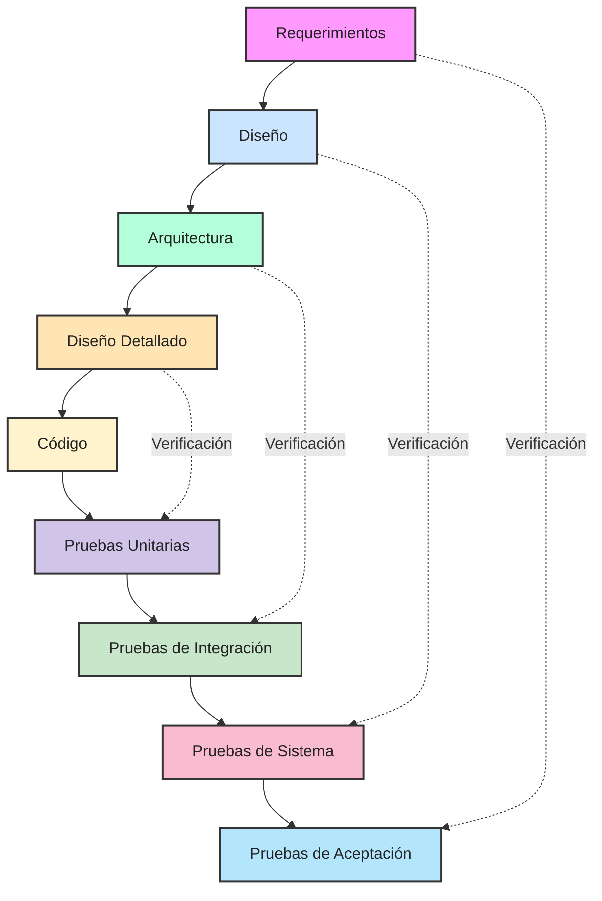

# SDLC 

## Resumen ejecutivo

El **Ciclo de Vida del Desarrollo de Software (SDLC)** es un proceso estructurado y estandarizado utilizado para desarrollar software de alta calidad de una manera eficiente y consistente. Fue concebido en la década de 1970 y sigue siendo relevante hoy en día como una guía para las etapas por las que pasa un producto de software hasta su éxito y evolución continua.
El propósito principal del SDLC es gestionar la complejidad y la evolución constante del software. 

Aplica distintos procesos y etapas de manera metódica y ordenada, lo que ayuda a evitar un crecimiento descontrolado de tareas y asegura que el software entregado cumpla con los requisitos especificados y funcione de manera confiable.
Aunque el número y los títulos de las fases pueden variar según el proyecto o la metodología específica, generalmente el SDLC tiene las siguientes etapas.

El SDLC (Ciclo de Vida del Desarrollo de Software) es un proceso ordenado para convertir necesidades en software funcional y mantenible. En este documento se describen las fases del SDLC, los modelos más comunes (Cascada, Ágil, Espiral y V), los riesgos y buenas prácticas. 

### Etapas del SDLC:

```mermaid
flowchart LR
    Planning["Planificación"]
    Analysis["Análisis de requisitos"]
    Design["Diseño"]
    Implementation["Implementación"]
    Testing["Pruebas"]
    Deployment["Despliegue"]
    Maintenance["Mantenimiento"]

    Planning --> Analysis
    Analysis --> Design
    Design --> Implementation
    Implementation --> Testing
    Testing --> Deployment
    Deployment --> Maintenance
    Maintenance --> Planning

    style Planning fill:#f9f,stroke:#333,stroke-width:2px,color:#111
    style Analysis fill:#ff9,stroke:#333,stroke-width:2px,color:#111
    style Design fill:#9ff,stroke:#333,stroke-width:2px,color:#111
    style Implementation fill:#9f9,stroke:#333,stroke-width:2px,color:#111
    style Testing fill:#f99,stroke:#333,stroke-width:2px,color:#111
    style Deployment fill:#99f,stroke:#333,stroke-width:2px,color:#111
    style Maintenance fill:#fc9,stroke:#333,stroke-width:2px,color:#111
```

1. Planificación (Planning)
   - **Objetivo**: Definir los objetivos del proyecto, su alcance y los requerimientos iniciales. Se busca entender qué debe hacer el producto final y cómo debe funcionar.
   - **Actividades Típicas**: 
     - Recopilación de requisitos de negocio y de uso
     - Estimación de costos y tiempo, y definición del alcance (scoping)
     - Enfoque en definir los objetivos y alcances de la iteración
     - Refinar y ajustar los planes
     - Identificación de características o funcionalidades a desarrollar
     - En el contexto de DevOps, puede implicar la revisión del backlog y la planificación de los Sprints
   - **Entregables**: Planes de proyecto, criterios de aceptación, estimaciones de recursos y tiempo. Aunque no se menciona explícitamente como entregable único de esta fase, la documentación de requerimientos comienza a gestarse aquí.
   - **Riesgos Comunes**: 
     - Requisitos iniciales poco claros, incompletos o ambiguos
     - Subestimación de costos o tiempos, lo que puede llevar a retrasos y sobrecostos en fases futuras
     - No identificar riesgos potenciales que debieron ser mitigados en esta etapa

2. Análisis de Requisitos (Requirements/Analysis)
   - **Objetivo**: Entender las necesidades del cliente, identificar y documentar los requerimientos funcionales y no funcionales del sistema. Comprender la factibilidad y coherencia de los requisitos.
   - **Actividades Típicas**:
     - Recopilar y documentar los requerimientos para el sistema, incluyendo las necesidades de todas las partes interesadas
     - Analizar los requerimientos para comprender su factibilidad y coherencia
     - Descomponer los requerimientos en componentes más pequeños y manejables
     - Identificar las relaciones entre los diferentes requerimientos
   - **Entregables**: Documento de especificaciones de requerimientos. Definición detallada de requerimientos funcionales y no funcionales.
   - **Riesgos Comunes**: Requisitos que no están completamente definidos al principio del proyecto o que se modifican con alta probabilidad durante el proceso de desarrollo, lo que puede causar que el modelo secuencial de cascada no sea el más adecuado y genere la necesidad de regresar a etapas anteriores, incurriendo en costos y tiempos adicionales.

3. Diseño (Design)
   - **Objetivo**: Crear una arquitectura de alto nivel del sistema, así como la estructura del software y de sus componentes. Detallar la arquitectura y la estructura interna de los componentes.
   - **Actividades Típicas**:
     - Diseño de la arquitectura de alto nivel del sistema
     - Especificación de interfaces y conexiones entre módulos, componentes y sistemas externos
     - Detallar el flujo de datos y el flujo de control dentro del sistema
     - Descomponer el sistema en módulos o componentes más pequeños y crear diseños detallados para cada uno
   - **Entregables**: 
     - Arquitectura de alto nivel del sistema
     - Especificaciones de diseño del sistema
     - Diseños arquitectónicos detallados y diseños de módulos
     - Selección de tecnologías
   - **Riesgos Comunes**:
     - Deficiencias en el diseño que no se identifican tempranamente
     - Una arquitectura ineficiente o demasiado compleja que afecte el rendimiento y la mantenibilidad del sistema

4. Implementación (Implementation)
   - **Objetivo**: Escribir el código del software siguiendo el diseño establecido. Convertir la visión en un producto real.
   - **Actividades Típicas**:
     - Codificación del software según las especificaciones de diseño
     - Realización de pruebas unitarias para verificar la funcionalidad individual de cada componente
     - Integración de componentes para formar un sistema completo
   - **Entregables**: Código fuente del software. Módulos y componentes del sistema, probados unitariamente.
   - **Riesgos Comunes**:
     - Introducción de errores de codificación o defectos que se detectarán en fases posteriores
     - Cuellos de botella o impedimentos en el equipo de desarrollo que retrasen la finalización de las tareas

5. Pruebas (Testing)
   - **Objetivo**: Ejecutar pruebas para verificar la interoperabilidad entre módulos y asegurar que el sistema cumple con los requerimientos especificados.
   - **Actividades Típicas**:
     - Ejecución de pruebas de integración
     - Realización de pruebas de sistema y de rendimiento
     - Pruebas de aceptación de los usuarios (UAT)
     - Identificación, documentación y corrección de errores
   - **Entregables**:
     - Informes de pruebas
     - Listado de defectos y su resolución
     - Software verificado y validado
   - **Riesgos Comunes**:
     - Detección tardía de errores o problemas críticos
     - Pruebas insuficientes que permitan que los defectos lleguen a producción

6. Despliegue (Deployment)
   - **Objetivo**: Desplegar el software en el entorno de producción. Capacitar a los usuarios finales para el uso del sistema.
   - **Actividades Típicas**:
     - Instalación y configuración del software en el entorno de producción
     - Capacitación y soporte a los usuarios finales
     - Utilización de herramientas de automatización y prácticas de infraestructura como código (IaC)
   - **Entregables**: Software operativo en el entorno de producción. Manuales de usuario y de operación.
   - **Riesgos Comunes**:
     - Problemas de compatibilidad o configuración en el entorno de producción
     - Resistencia o falta de adopción por parte de los usuarios finales
     - Interrupciones en los servicios existentes durante la transición

7. Mantenimiento (Maintenance)
   - **Objetivo**: Realizar correcciones de errores y actualizaciones del sistema según sea necesario.
   - **Actividades Típicas**:
     - Corrección de errores (parches)
     - Implementación de nuevas características o mejoras
     - Gestión de cambios y nuevas funcionalidades
     - Monitoreo continuo del rendimiento
   - **Entregables**:
     - Actualizaciones de software, parches y nuevas versiones
     - Informes de monitoreo y rendimiento
     - Documentación de los cambios realizados
   - **Riesgos Comunes**:
     - Costos de mantenimiento elevados
     - Dificultad para adaptarse a nuevos requerimientos
     - Problemas de seguridad no detectados o no corregidos a tiempo

## Modelos de SDLC

### Modelo en Cascada
Todo lo anterior mente mencionado es conocido como el modelo en cascada, descrito en los años 70, que es un enfoque secuencial y lineal donde cada fase debe completarse antes de pasar a la siguiente. Es adecuado para proyectos con requisitos bien definidos y estables.

### Modelo Ágil
El modelo ágil es un enfoque para el desarrollo de software que se centra en la entrega rápida y continua de software funcional. Su filosofía principal es estar abierto a los cambios hasta en etapas avanzadas del desarrollo.

Este modelo es especialmente útil cuando los requisitos del proyecto no están completamente definidos al principio o cuando pueden modificarse con el tiempo. En lugar de seguir una secuencia lineal y rígida como el modelo de cascada, el desarrollo ágil divide el trabajo en ciclos cortos llamados iteraciones o Sprints, que generalmente duran de 1 a 4 semanas. Al final de cada ciclo, se entrega una parte funcional del producto.

Dentro de la metodología ágil, existen varios marcos de trabajo populares, como Scrum, Kanban y Design Thinking, entre otros.

### Modelo Espiral
El modelo de espiral combina elementos de la metodología de cascada con la capacidad de revisar y ajustar etapas anteriores. Se divide en ciclos que se repiten, y es adecuado para proyectos grandes y complejos con una alta incertidumbre, ya que proporciona una estructura para gestionar riesgos.
Las fases de cada ciclo incluyen:
1. Determinación de objetivos: Identificar objetivos del proyecto y restricciones.
2. Análisis de riesgos: Evaluar y analizar riesgos, identificar obstáculos y priorizarlos.
3. Desarrollo y validación de prototipos: Desarrollar un prototipo y validarlo con usuarios para obtener retroalimentación temprana.
4. Planificación: Planificar actividades y recursos para la iteración.
5. Desarrollo y pruebas: Codificar el software y realizar pruebas continuas.
6. Revisión y evaluación: Evaluar el progreso y la satisfacción del cliente.
7. Preparación para el siguiente ciclo: Planificar el siguiente ciclo basándose en la retroalimentación y los riesgos identificados.

## Modelo en V

El modelo en V es una evolución del modelo en cascada que enfatiza la verificación y validación en cada etapa del desarrollo. En lugar de seguir una secuencia puramente lineal, implementa un enfoque que empareja cada fase de desarrollo con una fase de prueba correspondiente.
Características del modelo en V:
- Mantiene una estructura secuencial pero con énfasis en pruebas
El modelo en V se representa gráficamente como una V, donde cada fase de desarrollo tiene una fase de prueba correspondiente:

## Beneficios del SDLC

Los principales beneficios de implementar SDLC incluyen:

- ✅ **Control y seguimiento sistemático**: Permite monitorear cada fase del desarrollo de manera estructurada
- 📈 **Estimación precisa**: Facilita la planificación de tiempos y recursos necesarios
- 🔍 **Detección temprana**: Identifica errores y problemas en etapas iniciales del desarrollo
- 📊 **Documentación clara**: Mantiene registros estructurados de todo el proceso
- 🤝 **Comunicación efectiva**: Mejora la interacción entre el equipo y stakeholders
- 🎯 **Calidad garantizada**: Asegura la satisfacción del cliente y la calidad del producto

## Conclusión

La aplicación del Ciclo de Vida del Desarrollo de Software (SDLC) representa una herramienta valiosa para estructurar proyectos y garantizar resultados de calidad. En el ámbito académico, su principal oportunidad radica en brindar un marco ordenado que permite a los estudiantes comprender cómo se organiza un proyecto real, desarrollar disciplina en la planificación y afianzar competencias de análisis, diseño e implementación. Asimismo, en un futuro profesional, adoptar el SDLC facilita la comunicación con equipos multidisciplinarios, mejora la gestión del tiempo y recursos, y ofrece un camino más claro hacia entregables confiables.

Sin embargo, también existen limitaciones. En proyectos académicos o de menor escala, la aplicación estricta de todas las fases puede volverse rígida o demandar recursos que no siempre están disponibles, lo que podría generar retrasos o burocracia innecesaria. Además, en contextos donde los requisitos cambian con frecuencia, como en la industria tecnológica actual, los modelos más tradicionales del SDLC pueden resultar poco flexibles, requiriendo adaptaciones ágiles.

## Referencias

AltexSoft. (2023, 18 octubre). Software development life cycle: explained [Vídeo]. YouTube. https://www.youtube.com/watch?v=SaCYkPD4_K0

Ciclo de vida de desarrollo de software | Microsoft Power Automate. (s. f.). https://www.microsoft.com/es-es/power-platform/topics/phases-of-the-software-development-lifecycle

Jain, A., & Jain, A. (2025, 10 enero). Modelos del ciclo de vida del desarrollo de sistemas (SDLC). Visure Solutions. https://visuresolutions.com/es/gu%C3%ADa-de-limosna/modelos-de-ciclo-de-vida-del-desarrollo-de-sistemas/#:~:text=Modelo%20SDLC%20%C3%A1gil:Un%20modelo,para%20proyectos%20grandes%20y%20complejos.

JCO IT. (2024, 26 febrero). Ciclo de vida del desarrollo de software (SDLC) [Vídeo]. YouTube. https://www.youtube.com/watch?v=NQ5fMOhGVmo

Mahajan, A., Mahajan, A., & Mahajan, A. (2025, 18 septiembre). What is SDLC? Process, Phases, Benefits & Risks. sphinx solution -. https://www.sphinx-solution.com/blog/what-is-sdlc/

Nazarevich, D. (2025, 22 abril). Comprensión del ciclo de vida moderno de desarrollo de software (SDLC). Innowise. https://innowise.com/es/blog/what-is-sdlc/

¿Qué es el SDLC? - Explicación del ciclo de vida del desarrollo de software - AWS. (s. f.). Amazon Web Services, Inc. https://aws.amazon.com/es/what-is/sdlc/

